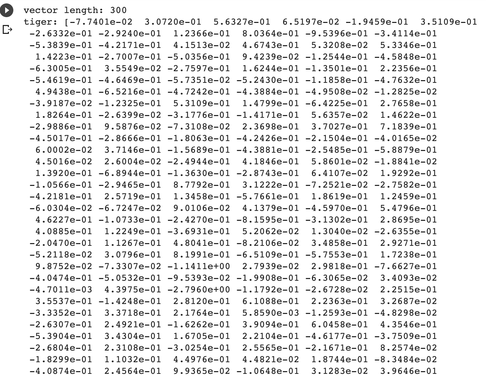

# Word2Vec Application Tutorial

The tutorial was created as a final project for IDCE 30274 Programming in GIS taught by professor Shadrock Robests at Clark University. 
Author: Anara Sharzhau

In this tutorial, we will learn how to perform basic operations on word vectors. Word vectors represent words as multidimensional continuous floating point numbers where semantically similar words are mapped to proximate points in geometric space. In simpler terms, a word vector is a row of real-valued numbers where each point captures a dimension of the word's meaning and where semantically similar words have similar vectors. While there are many Natural Language Processing (NLP) libraries in Python, such as NLTK, gensim, and spaCy, we will use spaCy in this tutorial. SpaCy is popular NLP library and it provides built-in support for word vectors.

## What is Word2Vec?
Word2Vec is a technique for natural language processing. The word2vec algorithm uses a neural network model to learn word associations from a large corpus of text. Once trained, such a model can detect synonymous words or suggest additional words for a partial sentence. As the name implies, word2vec represents each distinct word with a particular list of numbers called a vector. The vectors are chosen carefully such that a simple mathematical function (the cosine similarity between the vectors) indicates the level of semantic similarity between the words represented by those vectors.

Our goal is to learn:

* Python machine learning package (spaCy)
* Calculating word similarity using Word2Vec model
* Word analogy analysis
* Calculating sentence similarity using Word2Vec model
* Visualizing Word2Vec in 2D space

### To follow this this tutorial you will need:
- A Google account and a Colab notebook.

### Getting started 

First, let's install the spaCy Python library and download their model for the English language. We only need to do it once. Then we can import the spaCy library and other useful libraries such as numpy (used for linear algebra and vector operations in Python). We can load our downloaded English model in our environment.

```Python
!pip install spacy
!python -m spacy download en_core_web_lg
```
Then, import the following packages: 
```Python
# import packages
import spacy
import numpy as np
import csv
from sklearn.manifold import TSNE
from sklearn import linear_model
import matplotlib.pyplot as plt
%matplotlib inline
from IPython.display import clear_output
```
It is also crucial to load English language model if you are going to work with English. Other language models available [here](https://spacy.io/models). 
There are two ways of downloading the language model. The reason why I specify two of them here is because sometimes we can get an error while loading a model. Therefore, it is good to have two options available. Please remember that yiu need to choose *only one* option!

1. 
```Python
nlp = spacy.load('en_core_web_lg')
```
2. 
```Python
import en_core_web_lg
nlp = en_core_web_lg.load()
```

## Word similarity

By representing words in vectors, we can use linear algebra and vector space models to analyze the relationship between words. One simple task is to calculate the cosine of two word vectors, namely the [cosine similarity](https://www.sciencedirect.com/topics/computer-science/cosine-similarity#:~:text=Cosine%20similarity%20measures%20the%20similarity,document%20similarity%20in%20text%20analysis.). This cosine similarity measures the semantic similarity of words. While the value ranges from -1 to 1, it is usually used in the non-negative space [0, 1] where 0 means 0 similarity and 1 means extremely similar or even identical.

In order to calculate the cosine similarity between words, we have to know their vector representations first, which are provided by the Word2Vec model. In the spaCy English model, these vector representations (pretrained using Word2Vec) are already provided. All we need to do is to retrieve these words from the spaCy English model and we will have access to these vector representations.

```Python
# retrieve words from the English model vocabulary
tiger = nlp.vocab['tiger']
cat = nlp.vocab['cat']
train = nlp.vocab['train']

# print the dimension of word vectors
print('vector length:', len(tiger.vector))

# print the word vector
print('tiger:', tiger.vector)
```

The result should look like this: 




After retrieving the words and their vector representations, we can use the built-in similarity function (which implements cosine similarity) to calculate word similarity based on these vectors. Is 'tiger' more similar to 'cat' than 'train'? Can you find some properties of cosine similarity?

```Python
# you can calculate the similarity between words using 
# the built-in 'similarity' function
print('The similarity between tiger and tiger:', tiger.similarity(tiger))
print('The similarity between tiger and cat:', tiger.similarity(cat))
print('The similarity between cat and train:', cat.similarity(train))
print('The similarity between train and tiger:', train.similarity(tiger))
print('The similarity between cat and tiger:', cat.similarity(tiger))
```
`The similarity between tiger and tiger: 1.0

The similarity between tiger and cat: 0.541339

The similarity between cat and train: 0.26588532

The similarity between train and tiger: 0.2512126

The similarity between cat and tiger: 0.541339`

Now let's try some other words. Try to calculate the cosine similarity between 'hotel' and 'motel' and the cosine similarity between 'hotel' and 'hospital'. Which one is more similar to 'hotel'? 'motel' or 'hospital'?

```Python
# calculate the similarity of your own words using the built-in function
hotel = nlp.vocab['hotel']
motel = nlp.vocab['motel']
hospital = nlp.vocab['hospital']

# what is the similarity between (hotel, motel) and (hotel, hospital)
print(hotel.similarity(motel))
print(hotel.similarity(hospital))
```

Let's compute the [cosine similarity](https://www.sciencedirect.com/topics/computer-science/cosine-similarity#:~:text=Cosine%20similarity%20measures%20the%20similarity,document%20similarity%20in%20text%20analysis.) manually using its definition below. Then check if the result is the same as the one calculated by the built-in function.

𝑐𝑜𝑠𝑖𝑛𝑒_𝑠𝑖𝑚𝑖𝑙𝑎𝑟𝑖𝑡𝑦 = (𝐴,𝐵)=𝐴⋅𝐵 / ‖𝐴‖‖𝐵‖

```Python
# try to calculate cosine similarity manually
'''
cosine of V1 and V2 = dot product of V1 and V2 / product of V1 norm and V2 norm
To get the vector representation of a word, use .vector, e.g. car.vector
To calculate the dot product of two vectors V1 and V2, use np.dot(V1, V2)
To get the norm of a word vector, use .vector_norm, e.g. car.vector_norm, 
alternatively you can use np.linalg.norm(V1) to calculate the norm of V1
'''
cosine_cat_train = np.dot(cat.vector, train.vector)/(cat.vector_norm*train.vector_norm)
print('The similarity between cat and train calculated manually:', cosine_cat_train)
```

Now we know how to compare the similarity of two words using pretrained Word2Vec model. We can also use it to help us find semantically similar words, that is given a word retrieve similar words from the vocabulary. Let's give it a try! In our customized function, we first find all the words in our vocabulary (that has vector representations). Then we calculate the cosine similarity between our query word and each word in the vocabulary. We sort the similarity score in descending order. Finally, we retrieve the top n most similar words.

```Python
# function to look through all words in the vocabulary and find similar words
def most_similar(word, topn=10):
    allwords = [w for w in nlp.vocab if w.has_vector and w.is_lower and w.lower_ != word.lower_]  # get all words in the vocabulary
    by_similarity = sorted(allwords, key=lambda w: word.similarity(w), reverse=True)  # sort words by similarity in descending order
    return by_similarity[:topn]
```
Then we focus on our specific words that we used earlier:
tiger, cat and train. 

```Python
# find similar words
tiger_similar = [w.text for w in most_similar(cat)]
print('Similar words to tiger: ', tiger_similar)
```

the result is words that are similar to the word 'tiger' within the relation to the word 'cat'

`Similar words to tiger:  ['cats', 'kitten', 'dog', 'kitty', 'pet', 'puppy', 'kittens', 'feline', 'dogs', 'kitties']`


## Word Analogy

One interesting finding for the Word2Vec model is that it embeds some analogical relationships between words.

Man is to Woman as King is to Queen
Man - Woman = King - Queen

Paris is to France as Madrid is to Spain
Paris - France = Madrid - Spain

These relationships can be reconstructed using word embeddings.


Run the code below. 

```Python
# word analogy example
# king is to man as what is to woman?
king = nlp.vocab['king']
man = nlp.vocab['man']
woman = nlp.vocab['woman']

# resulting vector
result = king.vector - man.vector + woman.vector

# function to compute cosine similarity
cosine = lambda v1, v2: np.dot(v1, v2) / (np.linalg.norm(v1) * np.linalg.norm(v2))
```
Then let's see if there is a connection/similarity between the word *result* and all the words in the vocabulary. 

```Python
# what word does the 'result' vector closely correspond to?

# we can first check if the 'result' vector is similar to the 'queen' vector
queen = nlp.vocab['queen']
print('Similarity between queen and result:', cosine(result, queen.vector))

# find all words in our vocabulary (nlp.vocab), 
# make sure to just retrieve lower case words 
# and words that actually have vectors (.has_vector) 
# and filter out 'king', 'man', and 'woman'
allwords = [w for w in nlp.vocab if w.has_vector and w.is_lower and w.lower_ != 'king' and w.lower_ != 'man' and w.lower_ != 'woman']

# calculate the cosine similarity between the 'result' vector 
# and all word vectors in our vocabulary
# sort by similarity and print out the most similar one
candidates = sorted(allwords, key=lambda w: cosine(result, w.vector), reverse=True)
print([c.text for c in candidates[:5]])
```

Let's try:
Japan - Tokyo = Vietnam - Hanoi

```Python
# Tokyo is to Japan as Hanoi is to what?
Tokyo = nlp.vocab['Tokyo']
Japan = nlp.vocab['Japan']
Hanoi = nlp.vocab['Hanoi']

maybe_Vietnam = Japan.vector - Tokyo.vector + Hanoi.vector

allwords = [w for w in nlp.vocab if w.has_vector and w.lower_ != 'tokyo' and w.lower_ != 'hanoi' and w.lower_ != 'Japan']
candidates = sorted(allwords, key=lambda w: cosine(maybe_Vietnam, w.vector), reverse=True)
print([c.text for c in candidates [:5]])
```
Output: `['VietNam', 'VIETNAM', 'vietnam', 'Vietnam', 'cambodia']`

## Sentence/Document Level Similarity

Using word embeddings, we can also calculate similarity between sentences and documents. Since sentences and documents are composed of words, one easy way to obtain vector representations for sentences/documents is to calculate the average vectors of words.

Let's try to calculate the similarity among these three sentences:

 Students are presenting today.
 Public speaking can be challenging.
 Dogs are loyal animals.

```Python
# Word2Vec model does not provide vector representations for sentences or documents. How is the similarity between sentences computed?
# Since sentences are composed of words, an easy way to obtain the vector representations of sentences is by averaging the vectors of each word in the sentence.

s1 = (nlp.vocab['Students'].vector + nlp.vocab['are'].vector + nlp.vocab['presenting'].vector + \
    nlp.vocab['today'].vector + nlp.vocab['.'].vector)/5
s2 = (nlp.vocab['Public'].vector + nlp.vocab['speaking'].vector + nlp.vocab['can'].vector + \
    nlp.vocab['be'].vector + nlp.vocab['challenging'].vector + nlp.vocab['.'].vector)/6
s3 = (nlp.vocab['Dogs'].vector + nlp.vocab['are'].vector + nlp.vocab['loyal'].vector + \
    nlp.vocab['animals'].vector + nlp.vocab['.'].vector)/5

print(cosine(s1, s2))

print(cosine(s1, s3))
```
What is the level of similarity between these sentences?

Next, we will compare each sentence to one another as a whole using SpaCy:

```Python
# spaCy also supports similarity calculation between sentences and documents
target = nlp("Students are presenting today.")  # text about students

doc1 = nlp("Public speaking can be challenging.")  # text about students
doc2 = nlp("Dogs are loyal animals.")  # text about dogs

print('Similarity between target and doc1:', target.similarity(doc1))
print('Similarity between target and doc2:', target.similarity(doc2))
```

The result: 

`Similarity between target and doc1: 0.8471739954052393
 
 Similarity between target and doc2: 0.6558212697514417`

## Word Embeddings Visualization

Since the word vectors we use have 300 dimensions, we cannot visualize them. One natural way is to apply dimension reduction first and then visualize them. We use a popular dimension reduction technique called t-SNE to reduce the word vectors to 2D and then plot the words in our word analogy example to see if we can find some pattern visually.

An interactive visualization of word embeddings can be found [here](https://projector.tensorflow.org/)

```Python
# use t-SNE to do dimension reduction, from 300d to 2d
tsne_model = TSNE(n_components=2)

# get transformed vectors
data = np.array([king.vector, man.vector, queen.vector, woman.vector])
data_2d = tsne_model.fit_transform(data)

labels = ['king', 'man', 'queen', 'woman']

# plot the 2d vectors and show their labels
plt.scatter(data_2d[:, 0], data_2d[:, 1], s=100)
for i, txt in enumerate(labels):
    plt.annotate(txt, (data_2d[i,0], data_2d[i,1]), xytext=(2, 3), textcoords='offset points')
plt.show()
```
The output might look like this: 


# Next steps 
Today, we learned how to perform basic operations on word vectors. To explore more about Natural Language Processing tools you can use following resources: 

* [NLTK](https://www.youtube.com/watch?v=X2vAabgKiuM)

* [Intro to NLP](https://medium.com/towards-artificial-intelligence/natural-language-processing-nlp-with-python-tutorial-for-beginners-1f54e610a1a0)

* [Text classification from scratch](https://keras.io/examples/nlp/text_classification_from_scratch/) 

# Citation

https://www.sciencedirect.com/topics/computer-science/cosine-similarity#:~:text=Cosine%20similarity%20measures%20the%20similarity,document%20similarity%20in%20text%20analysis. 

https://www.codegrepper.com/code-examples/rust/OSError%3A+%5BE050%5D+Can%27t+find+model+%27en_core_web_lg%27.+It+doesn%27t+seem+to+be+a+shortcut+link%2C+a+Python+package+or+a+valid+path+to+a+data+directory.

https://colab.research.google.com/drive/1X3XmmomQZrR-rPGbo_w6yydDbui86tzK 

https://projector.tensorflow.org/ 
